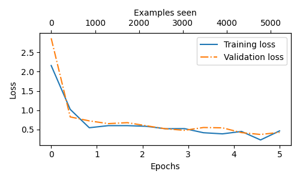
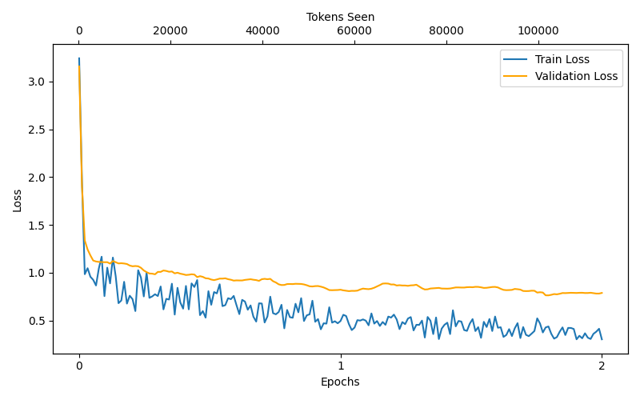

# LLM From Scratch

An implementation of a GPT style Large Language Model built from scratch using PyTorch. This repository contains the code for fundamental concepts of building, training, and fine-tuning language models, using Sebastian Raschka's 'Build a LLM from Scratch' book.

## Colab notebook:
[](https://colab.research.google.com/drive/1Rw_eBUzqHdjyqUs6ejScVMxXjZ3rxh7S?usp=sharing)

## Training Results

### Fine-Tuning Performance
**Classification Task (Spam Detection)**



**Instruction Tuning (Alpaca Dataset)**



## Source Files

### `src/data.py`
**Data Preprocessing & Tokenization**
- **SimpleTokenizerV1 & V2**: Custom tokenizers that convert text to numerical tokens
- **GPTDatasetV1**: PyTorch Dataset class for sliding window data loading
- **create_dataloader_v1**: Creates efficient data loaders with configurable batch size and stride

### `src/attention.py`
**Attention Mechanisms**
- **Self-Attention variants (v1 & v2)**: Basic self-attention implementations
- **CasualAttention**: Implements causal masking for autoregressive generation
- **MultiHeadAttention**: Efficient multi-head attention with parallel processing

### `src/model.py`
**GPT Architecture**
- **GPTModel**: Full implementation of GPT with configurable layers
- **TransformerBlock**: Combines attention and feed-forward layers
- **LayerNorm**: Layer normalization for training stability
- **GELU**: Gaussian Error Linear Unit activation function
- **FeedForward**: Position-wise feed-forward network

### `src/train.py`
**Training Pipeline**
- **train_model_simple**: Complete training loop with evaluation
- **calc_loss_batch/loader**: Loss calculation utilities
- **generate**: Text generation with temperature and top-k sampling
- **plot_losses**: Visualization of training progress

### `src/finetune_classification.py`
**Classification Fine-tuning**
Fine-tune GPT for text classification tasks:
- SMS spam detection implementation using the SMS Spam Collection dataset
- Dataset balancing and preprocessing for classification
- Converts generative model to classification model

### `src/finetune_instructions.py`
**Instruction Fine-tuning**
Fine-tune GPT to follow instructions:
- Implements Alpaca-style prompt formatting
- Loads instruction-following datasets (instruction-input-output format)
- Fine-tunes model for instruction-following capabilities

## Project Structure by Chapter

### Chapter 2: Working with Text Data
- `src/data.py`

### Chapter 3: Coding Attention Mechanisms
- `src/attention.py`

### Chapter 4: Implementing a GPT Model
- `src/model.py`

### Chapter 5: Pretraining on Unlabeled Data
- `src/train.py`

### Chapter 6: Fine-tuning for Classification
- `src/finetune_classification.py`

### Chapter 7: Fine-tuning for Instructions
- `src/finetune_instructions.py`
- `data/instruction-data.json`

## Setup

1. Install dependencies:
```bash
pip install -r requirements.txt
```

2. Run the training scripts:
```bash
# Pretrain the model
python src/train.py

# Fine-tune for classification
python src/finetune_classification.py

# Fine-tune for instructions
python src/finetune_instructions.py
```